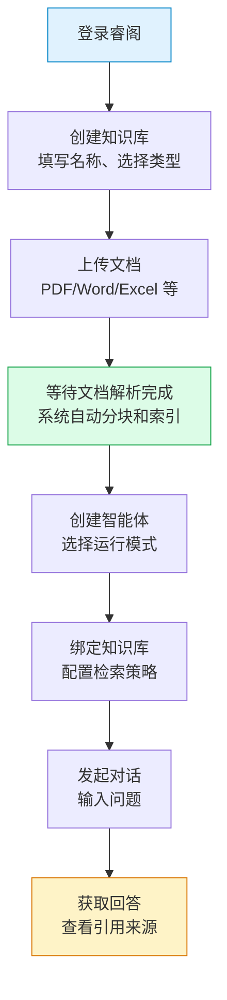

## 概述

本教程带你从零开始，在睿阁中完成**第一个知识库的完整搭建**：创建知识库、上传文档、配置智能体、发起第一次问答。读完本文，你将得到一个可以正常检索和回答问题的知识库，并成功发起第一次对话。

睿阁的知识问答流程分为三个阶段：

- **知识入库**：创建知识库 → 上传文档 → 系统自动解析、分块、建立索引。
- **智能体配置**：创建智能体 → 选择运行模式 → 绑定知识库。
- **发起对话**：选择智能体 → 输入问题 → 获取基于知识库的回答。

### 端到端流程



---

## 前置条件

- 已有睿阁的访问账号，并能正常登录。
- 准备好要上传的文档文件（支持 PDF、Word、Excel、PPT、Markdown、TXT 等格式，单文件不超过 100MB）。
- 系统已配置至少一个对话模型（LLM）和一个向量模型（Embedding）。

---

## 操作步骤

### 步骤 1：创建知识库

1. 登录睿阁后，点击左侧侧边栏的「**知识库**」菜单。
2. 在知识库列表页右上角点击「**新建知识库**」按钮。
3. 在弹出的知识库设置面板中，填写以下信息：

   | 字段 | 是否必填 | 说明 |
   | --- | --- | --- |
   | 知识库类型 | 必填 | 选择「文档」或「问答」。首次使用建议选择「文档」 |
   | 索引策略 | 必填 | 勾选「RAG 检索」（默认开启），同时启用向量检索和关键词检索 |
   | 知识库名称 | 必填 | 输入知识库名称，如"产品使用手册"，最多 50 字 |
   | 知识库描述 | 可选 | 简要描述知识库的用途，如"包含产品安装、配置和使用说明"，最多 200 字 |

4. 在左侧导航点击「**模型配置**」，确认以下模型已自动选择：

   | 字段 | 说明 |
   | --- | --- |
   | LLM 大语言模型 | 用于生成回答的模型，系统会自动选择默认模型 |
   | Embedding 嵌入模型 | 用于文本向量化的模型，创建后不可更改 |

5. 其他高级配置（分块设置、知识图谱等）保持默认即可。
6. 点击底部「**创建**」按钮完成创建。

> 提示：知识库名称建议使用具体、易识别的名称，如"2025年产品手册"而非"文档1"。创建后知识库类型和 Embedding 模型不可更改。

### 步骤 2：上传文档

1. 创建成功后，系统自动进入知识库详情页。
2. 点击页面中的「**上传文件**」按钮（或拖拽文件到上传区域）。
3. 选择要上传的文档文件，支持一次选择多个文件。
4. 文件上传后，系统自动开始解析和入库处理：

   | 处理阶段 | 说明 |
   | --- | --- |
   | 文档解析 | 提取文档文本内容（根据配置的解析引擎） |
   | 文本分块 | 将长文档切分为更小的文本片段 |
   | 向量索引 | 使用 Embedding 模型将文本转换为向量并建立索引 |
   | AI 问题生成 | 为每个分块自动生成问题，提升召回率（默认开启） |

5. 在文档列表中查看每个文件的处理状态。状态为「完成」表示该文件已可被检索。

> 注意：文档入库时间取决于文件大小和配置的功能。普通文档通常在几分钟内完成。如果启用了 AI 问题生成和知识图谱等高级功能，处理时间会更长。详见 [知识库](/zh/concepts/01-knowledge-base) 中的分块原理和 AI 问题生成说明。

### 步骤 3：创建智能体

1. 点击左侧侧边栏的「**智能体**」菜单，进入智能体列表页。
2. 点击右上角的「**创建**」按钮。
3. 在智能体编辑器中，完成以下配置：

   **基本信息**：

   | 字段 | 建议值 | 说明 |
   | --- | --- | --- |
   | 运行模式 | 快速问答 | 首次使用建议选择快速问答，配置简单、响应快 |
   | 名称 | 如"产品助手" | 智能体的显示名称 |
   | 描述 | 如"基于产品文档的问答助手" | 简要描述智能体的用途 |

   **提示词**：

   在「系统提示词」输入框中输入智能体的角色设定和行为准则。示例：

   ```
   你是一个专业的产品技术支持助手。请基于知识库中的文档内容回答用户问题。
   回答要求：
   1. 引用具体的文档来源
   2. 使用简洁专业的语言
   3. 如果知识库中没有相关信息，请如实告知
   ```

   **模型配置**：

   | 字段 | 建议值 | 说明 |
   | --- | --- | --- |
   | 模型 | 保持默认 | 系统自动选择默认的对话模型 |
   | 温度 | 0.5 | 值越低回答越确定，值越高越随机 |
   | 重排序模型 | 保持默认 | 用于对检索结果进行重排序 |

   **知识库**：

   | 字段 | 建议值 | 说明 |
   | --- | --- | --- |
   | 知识库选择模式 | 全部 | 使用所有可用知识库；也可选择「选择」手动指定 |

4. 点击底部「**保存**」按钮完成创建。

> 提示：智能推理模式支持工具调用、多步推理等高级能力，适合复杂场景。但首次使用建议先从快速问答模式开始，熟悉基本流程后再尝试智能推理。详见 [智能体](/zh/concepts/02-agent)。

### 步骤 4：发起对话

1. 点击左侧侧边栏的「**新对话**」菜单，进入对话页面。
2. 在输入框左下方的智能体选择器中，确认已选中刚才创建的智能体。
3. 在输入框中输入与知识库内容相关的问题，例如：
   - "产品如何安装？"
   - "系统支持哪些文件格式？"
   - "如何配置 XX 功能？"
4. 按 **Enter** 或点击发送按钮提交问题。
5. 等待智能体回答。回答中会引用知识库中的具体内容，底部会显示引用来源。
6. 可以继续追问，智能体会结合上下文进行多轮对话。

> 提示：如果智能体回答「抱歉，暂时无法回答这个问题」，说明知识库中没有检索到相关内容。请检查：① 文档是否已解析完成（状态为「完成」）；② 问题是否与文档内容相关；③ 尝试换一种问法。

---

## 进阶用法

### 使用智能推理模式

如果快速问答模式无法满足需求，可以将智能体切换为智能推理模式：

1. 编辑智能体，将运行模式切换为「智能推理」。
2. 选择一个类型预设（如「RAG 问答」），系统会自动配置工具和提示词。
3. 在工具配置中勾选需要的工具（如思考、语义搜索、关键词搜索等）。
4. 保存后重新发起对话，智能体会展示思考过程和工具调用详情。

### 开启联网搜索

如果需要智能体回答知识库之外的实时信息：

1. 编辑智能体，进入「网络搜索」配置。
2. 开启「网络搜索」开关。
3. 配置搜索引擎和最大搜索结果数。
4. 保存后，智能体在回答时会同时检索知识库和互联网。

### 配置多轮对话

在快速问答模式下，可以开启多轮对话以保留上下文：

1. 编辑智能体，进入「多轮对话」配置。
2. 开启「多轮对话」开关。
3. 设置保留轮数（默认 5 轮）。
4. 建议同时开启「问题改写」，自动消解指代和省略，提升多轮对话的检索准确性。

---

## 常见问题

### Q1：文档上传后一直显示"处理中"怎么办？

文档入库包含解析、分块、索引等多个阶段，大文件或复杂文档（如扫描件 PDF）处理时间较长。如果长时间未完成，请检查：
- 解析引擎是否正常运行（可在系统设置中查看）。
- 如果是扫描件 PDF，是否已配置多模态视觉模型。
- 查看文档的 Trace 日志了解具体处理进度。

### Q2：智能体回答不准确怎么办？

可以从以下几个方面优化：
- **优化提示词**：在系统提示词中明确回答要求和禁止行为。
- **调整检索策略**：增大致向召回数量、降低向量阈值以扩大检索范围。
- **添加 Rerank 模型**：对检索结果进行重排序，提升相关性。
- **优化知识库内容**：确保文档内容准确、完整，分块合理。

### Q3：如何知道智能体回答引用了哪些文档？

智能体的回答底部会显示引用来源，包括文档名称和匹配的相关度分数。点击引用可以跳转到知识库中的对应文档。

### Q4：知识库内容更新后，智能体的回答会自动更新吗？

是的。当知识库中的文档更新或新增后，系统会自动重新建立索引。智能体下次回答时会使用最新的知识库内容。

### Q5：一个智能体可以绑定多个知识库吗？

可以。在智能体的知识库配置中，选择「全部」模式可访问所有知识库，选择「选择」模式可手动指定多个知识库。企业版中智能体默认可访问所有可见知识库。

---

## 相关文档

- 概念理解：
  - [知识库](/zh/concepts/01-knowledge-base)（知识库类型、分块原理、向量检索原理）
  - [智能体](/zh/concepts/02-agent)（运行模式、工具体系、检索策略）
  - [团队协作](/zh/concepts/03-team-collaboration)（角色权限、知识库共享）

---

> 最后更新：2026-09-09 | 对应版本：v1.0.0
